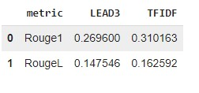

Multi-News [dataset](https://huggingface.co/datasets/alexfabbri/multi_news) is used for summarization.

# Description 

The simplest form of summarization is extractive one. In this work the similarity scores of document's sentences are computed from the cosine similarity matrix computed between TFIDF - feature vectors. Comparison with the baseline LEAD3 (3 first sentences in the document) is conducted using standard metrics Rouge1 and RougeL. The TFIDF-based approach as expected has outperformed the naive LEAD3.

