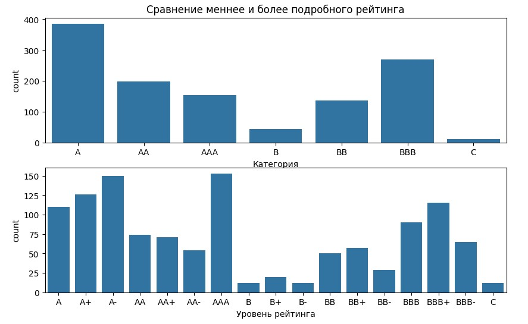
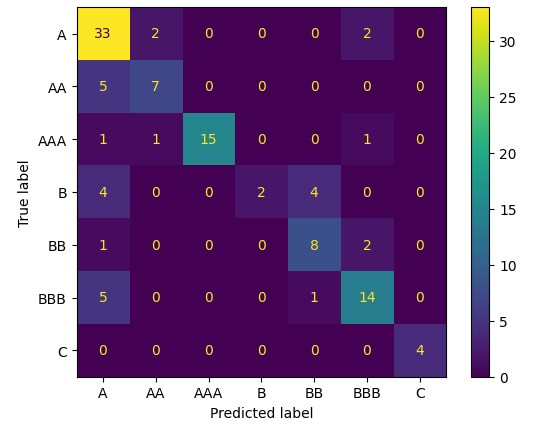
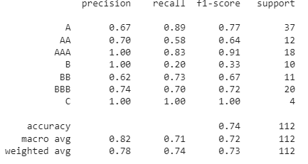
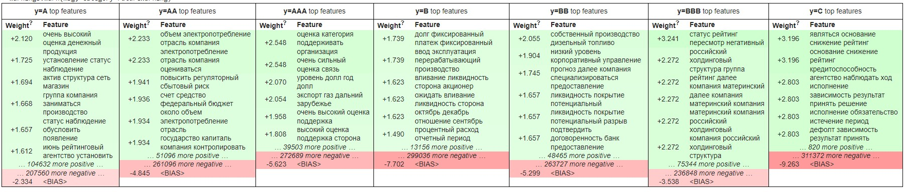

Данная командная задача была предоставлена в финале совместной программы Финтех Хаба и банка ВТБ "Искусственный интеллект и машинное обучение PRO", а ткаже была защищена на конференции  Data Fusion 2024г.
# Описание
Задача заключается в определениее рейтинга кредитоспособности компании по тексту пресс-релиза написанного кредитно-рейтинговым агенством. Также желательно, чтобы модель была интерпретируема, т.е. выдавала причины принятого ею решения. На предоставленные данные можно посмотреть [здесь](dataset/README.md) 
Существует 7 классов рейтинга, которые дробятся на более подробные, что приводит к 17 классам. В рамках нашей работы мы ограничились работой с 7 классами, т.к. данных очень мало (порядка 1200) и классифицировать на 17 классов является сложной задачей для обобщения моделью.

# Классификация 5-грамм логистической регрессией и интерпретация её весов с помощью [ELI5](https://eli5.readthedocs.io/en/latest/tutorials/sklearn-text.html)

Моей частью работы было классифицировать с помощью логистической регрессии используя фичами 5-граммы (последовательности из 5 токенов). На 7 классах были получены следующие результаты:

Затем по величине весов логисстической регрессии можно судить о важности той или иной 5-граммы, библиотека ELI5 позволяет визуализировать эти 5-граммы для каждого класса:

Для каждого класса были запомнены топ-100 5-грамм по величине веса логистической регрессии.
Простейшим способом интерпретации результатов предсказания модели, это найти среди топ-100 запомненных 5-грамм для данного класса, те которые встречаются в данном конкретном пресс-релизе и вывести предложения содержащие эти 5-граммы.
