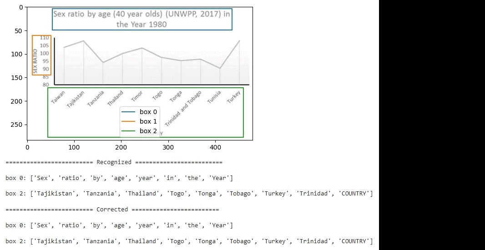

Benetech - Making Graphs Accessible [dataset](https://www.kaggle.com/competitions/benetech-making-graphs-accessible) is used for this work.

# Description

The goal of this toy project  is to create a pipeline that recognizes graph titles and tick labels from pictures, perform OCR and then spelling correction. This kind of problem might arise when someone wants to digitize scanned documents with figures and graphs.
[EasyOCR](https://github.com/JaidedAI/EasyOCR) and [Spylls](https://github.com/zverok/spylls) are used for the OCR and spelling correction.
