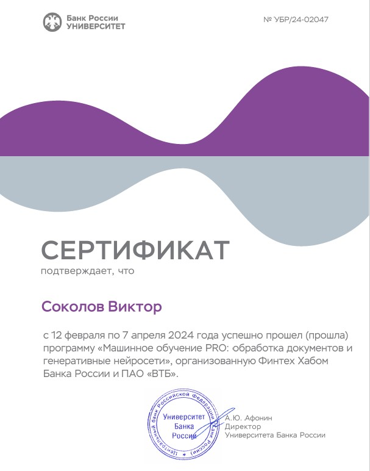
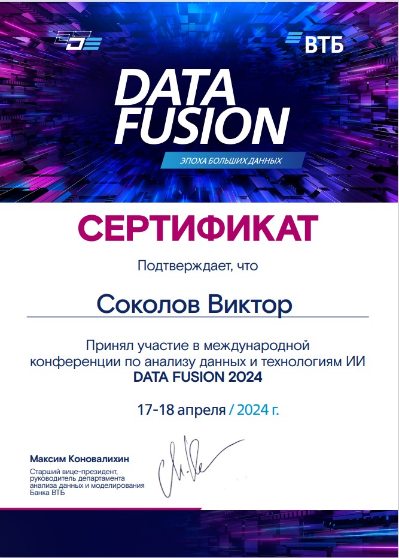

# NLP_PRO_Fintech
Задания и финальный проект совместной программы Финтех Хаба и банка ВТБ "Искусственный интеллект и машинное обучение PRO" с последующей защитой на Data Fusion 2024г.  
1.[Бинарная и многоклассовая классификация обзоров на женскую одежду](Review_Classification/README.md)  
2.[Экстрактивная саммаризация новостей](Extractive_Summarization/README.md)   
3.[Извлечение названий и меток осей графиков](OCR_Spell_Correction/README.md)   
4.[Классификация пресс-релизов кредитно-рейтинговых компаний](Final_Project_Data_Fusion/README.md)   

