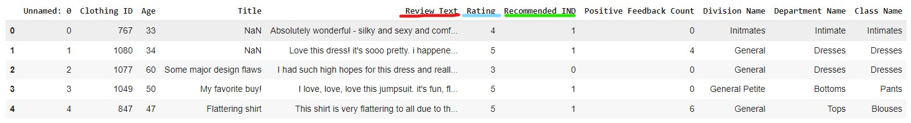
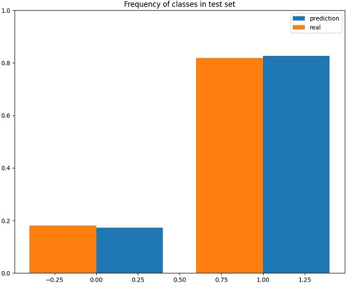
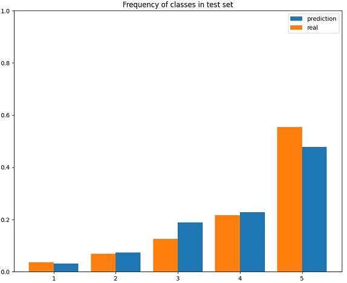

Women's E-Commerce Clothing Reviews [dataset](https://www.kaggle.com/datasets/nicapotato/womens-ecommerce-clothing-reviews) is used

# Description
The language model [DistilBERT](https://huggingface.co/distilbert/distilbert-base-uncased) serves as teh backbone with corresponding trainable classification head. Both tasks described below aimed at classification of Review Text for different targets.

# Task 1: Female Clothing Binary Classification (target: Recommended IND): [](http://colab.research.google.com/github/Viktor-Sok/NLP_PRO_Fintech/blob/main/Review_Classification/notebooks/Female_Clothing_Recommendation_Prediction.ipynb)
The target Recommended IND is binary. The classes are moderately unbalanced. The result of predictions on the test dataset:
 

# Task2: Female Clothing Multiclass Classification (target: Rating) : [](http://colab.research.google.com/github/Viktor-Sok/NLP_PRO_Fintech/blob/main/Review_Classification/notebooks/Female_Clothing_Rating_Prediction.ipynb)

The target Rating has 5 classes which are unbalanced.
To deal with the imbalance, weighted cross-entropy is used: 
```
torch.nn.CrossEntropyLoss(weight=self.weights)
```
To compute the weights we use the follwoing sklearn function:
```
sklearn.utils.class_weight.compute_class_weight
```
The predictions on the test dataset:



